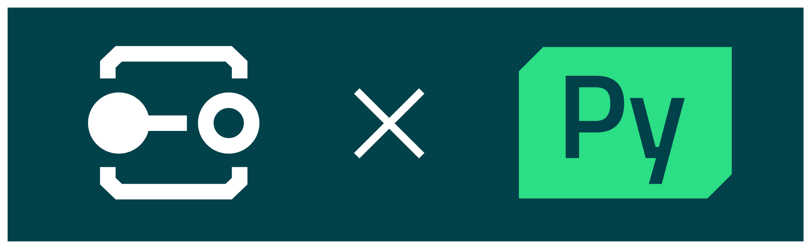

<div align="center">

# Qt for Python AI Skills



Collection of Qt for Python skill plugins for Claude Code and GitHub Copilot.

[](https://www.python.org/)
[](https://doc.qt.io/qtforpython)

[](#)
[](#)

</div>

---


[](https://github.com/astral-sh/uv)
[](https://github.com/astral-sh/ruff)

## Overview

Qt for Python AI Skills is a collection of Qt for Python skill plugins for Claude Code and GitHub Copilot.

It provides plugins to streamline Qt for Python development, including GUI testing, code review, and coding assistance.

## Add to marketplace

```bash
/plugin marketplace add AJpon/qt-python-ai-skills
```

After adding, install plugins with `/plugin install <plugin-name>@ajpon-qt-python-plugins`.

## Included plugins

| Plugin | Description |
| --- | --- |
| [qt-python-ui-testing](plugins/qt-python-ui-testing) | A skill to review and automate GUI tests for Qt for Python apps. It can simulate real mouse/keyboard interactions and verify rendering results via screenshots. |
| qt-development-skills | A set of skills for Qt C++/QML code review, coding and documentation generation (provided from [TheQtCompanyRnD/agent-skills](https://github.com/TheQtCompanyRnD/agent-skills)). |

Plugin definitions can be found in [.claude-plugin/marketplace.json](.claude-plugin/marketplace.json).

## Repository layout

```ascii
.
├── .claude-plugin/marketplace.json  # marketplace definitions
├── plugins/                         # plugins authored in this repo
│   └── qt-python-ui-testing/
├── packages/                        # uv workspace member (Python packages)
├── scripts/                         # uv workspace member (scripts)
├── tools/                           # uv workspace member (tools)
└── src/python_package/              # sample Python package
```

## Python development setup

This repository also serves as a Python project template powered by [uv](https://github.com/astral-sh/uv).

```bash
uv sync
uv run pre-commit install
```
